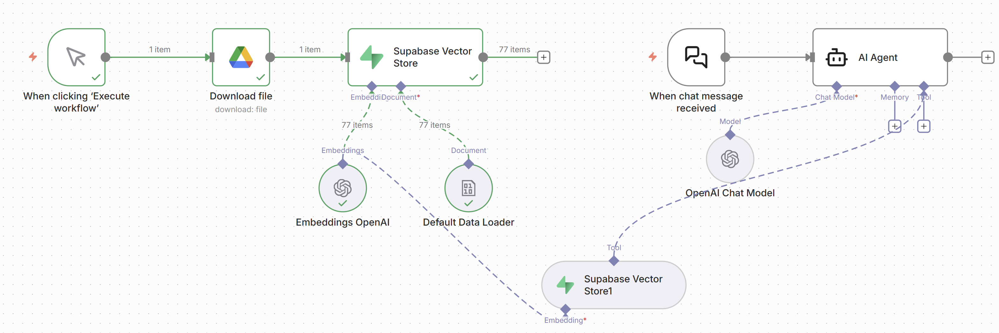

# n8n RAG Knowledge Assistant

I built this project to create an AI assistant that can answer questions using information stored in documents instead of relying only on the language model's general knowledge.

The workflow uses Google Drive to load documents, OpenAI to create embeddings, Supabase as the vector database, and an AI Agent in n8n to retrieve relevant information when a user asks a question.

## Workflow



## How It Works

The project has two main parts.

### 1. Document Processing

- Downloads a document from Google Drive
- Loads and processes the document
- Creates vector embeddings using OpenAI
- Stores the embeddings in Supabase Vector Store

### 2. Question Answering

- User sends a question through the n8n chat
- The AI Agent analyzes the question
- Supabase Vector Store retrieves the most relevant document information
- OpenAI uses the retrieved context to generate the final response

## Workflow

```text
Google Drive
     |
     v
Download File
     |
     v
Data Loader
     |
     v
OpenAI Embeddings
     |
     v
Supabase Vector Store


User Question
     |
     v
AI Agent
     |
     +---- OpenAI Chat Model
     |
     +---- Supabase Vector Store
                 |
                 v
        Relevant Document Data
                 |
                 v
            AI Response
